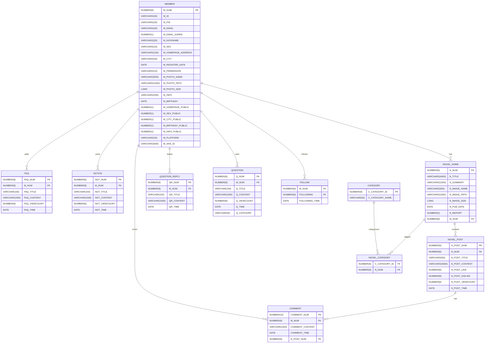

# NovelReader

## 프로젝트 개요

### ✅ **프로젝트 소개**  
**NovelReader**는 웹소설, 라이트노벨, 클래식 문학 등을 편리하게 읽을 수 있는 **소설 웹뷰어 서비스 플랫폼**입니다.  
독자들이 원하는 소설을 쉽게 찾아 읽고, 작가들은 더 나은 환경에서 창작할 수 있도록 지원하는 다양한 기능을 제공합니다.

### ✅ **프로젝트 필요성(배경)**  
웹소설과 전자책 시장의 급성장에 따라 많은 소설 웹뷰어 서비스가 등장했습니다.  
하지만 아직까지 **작가와 독자**가 원하는 **기능에 쉽게 접근**할 수 있는 유저 친화적인 서비스는 부족한 상황입니다.  
**NovelReader**는 이러한 시장의 요구를 충족시킬 수 있는 **직관적이고 효율적인 플랫폼**을 제공합니다.

### ✅ **프로젝트 목표**  
- **다양한 소설 콘텐츠**를 한 곳에서 **편리하게** 읽을 수 있는 통합 뷰어 제공  
- **직관적인 디자인**으로 원하는 기능에 쉽게 접근할 수 있는 **페이지 이동** 설계  
- **독자와 작가**가 원하는 맞춤형 기능을 **쉽고 빠르게 사용할 수 있도록** 최적화된 인터페이스 제공

## 팀 소개

|  |  |  |  |  |
|--|--|--|--|--|
|  **김준기** [@rwr9857](https://github.com/rwr9857)  **팀장** |  **강민수** [@Dongmool](https://github.com/Dongmool)  **백엔드 개발**|  **류익현** [@ikcon97](https://github.com/ikcon97)  **백엔드 개발**|  **박승은** [@noqo23](https://github.com/noqo23)  **프론트엔드 개발**|  **안태균** [@taekyun01](https://github.com/taekyun01)  **프론트엔드 개발**|

## 기술 스택

| 구분  | 사용 기술   |
|------|-----------|
| **프론트엔드** |   |
| **백엔드** |   |
| **데이터베이스** | |
| **형상관리** | |
| **개발 도구** |   |

## 주요 기능

- ✅ 간편한 SNS 로그인 시스템
- ✅ 회원끼리 팔로우 가능한 시스템
- ✅ 회원 프로필 관리 시스템
- ✅ 관리자와 소통할 수 있는 문의게시판
- ✅ 작가의 연재 관리를 위한 글등록 시스템
- ✅ 짧은 회차 기반의 소설 뷰어 기능
- ✅ 회차마다 독자가 리뷰을 남길 수 있는 기능

## ERD (Entity Relationship Diagram)

## 클래스 다이어그램

## 화면 디자인

